# Jermaine Hunter 👋🏾  
### Identity-First Detection Engineering | Cloud & AI Security
**Design → Deploy → Defend**

---

## ⚡ Telemetry & Detection Pipeline

```mermaid
flowchart LR
    subgraph T["01 · Telemetry Sources"]
        direction TB
        T1["Cloud Audit Logs"]
        T2["IAM & Identity Events"]
        T3["LLM & AI Workloads"]
        T4["Application & Honeypot Logs"]
    end

    subgraph N["02 · Normalize & Enrich"]
        direction TB
        N1["Parse & Validate Events"]
        N2["Normalize Actor · Action · Target"]
        N3["Enrich Context & Outcomes"]
    end

    subgraph D["03 · Detection & Analysis"]
        direction TB
        D1["Sigma / Custom Detection Rules"]
        D2["MITRE ATT&CK Mapping"]
        D3["Behavioral Analysis & Correlation"]
    end

    subgraph R["04 · Triage & Response"]
        direction TB
        R1["Alert Prioritization"]
        R2["Investigation & Evidence"]
        R3["Response Playbooks"]
    end

    T --> N
    N --> D
    D --> R

    classDef source fill:#161b22,stroke:#58a6ff,color:#c9d1d9,stroke-width:1px;
    classDef process fill:#161b22,stroke:#3fb950,color:#c9d1d9,stroke-width:1px;
    classDef detect fill:#161b22,stroke:#d29922,color:#c9d1d9,stroke-width:1px;
    classDef respond fill:#161b22,stroke:#bc8cff,color:#c9d1d9,stroke-width:1px;

    class T1,T2,T3,T4 source;
    class N1,N2,N3 process;
    class D1,D2,D3 detect;
    class R1,R2,R3 respond;

    style T fill:#0d1117,stroke:#58a6ff,stroke-width:1px,color:#58a6ff
    style N fill:#0d1117,stroke:#3fb950,stroke-width:1px,color:#3fb950
    style D fill:#0d1117,stroke:#d29922,stroke-width:1px,color:#d29922
    style R fill:#0d1117,stroke:#bc8cff,stroke-width:1px,color:#bc8cff;
```

---

## 🛠️ Core Competencies

| 🛡️ Security Fundamentals & Frameworks | </> Python & Security Tool Development | ☁️ Cloud Security & Investigation | 🤖 AI Application Security |
| :--- | :--- | :--- | :--- |
| • CompTIA Security+ certified • OWASP Top 10 for LLM Applications • Sigma Rules • MITRE ATT&CK Mapping • KQL / YARA-L | • Python CLI development • Security data parsing and validation • Canonical Event Modeling • JSON/YAML schema-driven workflows | • IAM roles and least-privilege access • Cloud audit-log and VPC Flow Log analysis • Security Command Center and cloud security assessment concepts • Breach simulation and investigation workflows • Terraform-based security architecture, where implemented | • RAG application security testing • Prompt-injection test cases • Security test automation • Security findings and remediation documentation|

---

## 🚀 Featured Case Studies & Repositories

Each repository follows an applied engineering lifecycle: **Threat Scenario → Architecture & Telemetry → Detection Logic → Automated Playbook Execution**.

### 🛠️ [ir-playbook-automation](https://github.com/jhunterdesign/ir-playbook-automation)
> **Automated Incident Response & NIST SP 800-61 / SANS Runbook CLI**
* **Focus:** Incident response automation, volatile memory credential handling, automated Sigma rule compilation, and dynamic HTML/PDF reporting.
* **Tech:** Python, CLI tooling, Jinja2, Sigma YAML.

### 🔥 [Big’s BBQ & Smokehouse](https://github.com/jhunterdesign)
> **Production-Simulated Honeypot & Web Telemetry Defense**
* **Focus:** Simulating web abuse patterns, exposing telemetry blind spots, and validating detection coverage against active reconnaissance.
* **Tech:** Python, Flask, Custom Telemetry Ingestion, SIEM Parsing.

### 🏥 Glenville Health Systems *(Active Development)*
> **Healthcare Identity-First Detection Architecture**
* **Focus:** Enterprise identity telemetry modeling, privileged access tracking, and canonical event validation (`Actor • Action • Target • Outcome • Context`).
* **Tech:** Cloud IAM, Audit Telemetry, Sigma Rules, Policy Hardening.

### 🤖 AI Security & Defense Labs
> **LLM Workload Hardening & Adversarial Testing**
* **Focus:** Prompt injection mitigation frameworks, RAG data ingestion boundaries, and model inference logging.
* **Tech:** Python, API Security, LLM Validation Guards.

---

## 📜 Certifications

- [**CompTIA Security+ Certified**](https://www.credly.com/badges/bb94f262-ffcc-4fb4-bcd9-7debb52cdad1/public_url) · July 2026
- Google Cloud Security Professional Certification
- Google Cybersecurity Professional Certification

---

## 🎯 Target Roles & Engineering Philosophy

**Focus Roles:** Cloud Security Engineering | Detection Engineering | AI Security Engineering | SecOps

> **Design intentionally. Deploy thoughtfully. Defend continuously.**
