# Jermaine Hunter 👋🏾  
### Identity-First Detection Engineering | Cloud & AI Security
**Design → Deploy → Defend**

---

## ⚡ Telemetry & Detection Pipeline

```mermaid
flowchart LR
    %% Subgraphs
    subgraph T [Inbound Telemetry]
        direction TB
        t1[Cloud Audit Logs]
        t2[IAM & Identity Provider]
        t3[LLM & AI Workloads]
        t4[Application & Honeypot]
    end

    subgraph D [Ingestion & Normalization]
        direction TB
        d1[Canonical Schema Parsing]
        d2[Actor • Action • Target]
        d3[Outcome • Context]
    end

    subgraph E [Threat Detection Engine]
        direction TB
        e1[Sigma Rule Matching]
        e2[MITRE ATT&CK Mapping]
        e3[Chronicle / Splunk Analytics]
    end

    subgraph P [Playbooks & Response]
        direction TB
        p1[Automated Runbooks]
        p2[Alert Scoring & Triage]
        p3[Incident Remediation]
    end

    %% Pipeline Flow
    T --> D
    D --> E
    E --> P

    %% Styling
    classDef box fill:#161b22,stroke:#30363d,stroke-width:1px,color:#c9d1d9,font-size:12px;
    classDef category fill:#0d1117,stroke:#58a6ff,stroke-width:1.5px,color:#58a6ff,font-weight:bold;

    class t1,t2,t3,t4,d1,d2,d3,e1,e2,e3,p1,p2,p3 box;
    class T,D,E,P category;
```

---

## 🛠️ Core Competencies

| 🔍 Detection & SIEM | ☁️ Cloud & Identity Security | ⚙️ Programming & Automation | 🛡️ Defensive Engineering |
| :--- | :--- | :--- | :--- |
| • Chronicle SecOps • Splunk Core / ES • Sigma Rules • MITRE ATT&CK Mapping • KQL / YARA-L | • Google Cloud (IAM, Audit Logs, SCC) • Microsoft Azure & Sentinel • Canonical Event Modeling • Zero Trust Architecture | • Python (Defensive CLI & Scripting) • Bash / Linux Administration • CI/CD & SAST Workflows • JSON / YAML Schemas • REST APIs & Webhooks | • Incident Response Playbooks • Web Abuse Honeypots • Threat Modeling & Runbooks • LLM / Prompt Injection Defense |

---

## 🚀 Featured Case Studies & Repositories

Each repository follows an applied engineering lifecycle: **Threat Scenario → Architecture & Telemetry → Detection Logic → Automated Playbook Execution**.

### 🛠️ [ir-playbook-automation](https://github.com/jhunterdesign/ir-playbook-automation)
> **Automated Incident Response & NIST SP 800-61 / SANS Runbook CLI**
* **Focus:** Incident response automation, volatile memory credential handling, automated Sigma rule compilation, and dynamic HTML/PDF reporting.
* **Tech:** Python, CLI tooling, Jinja2, Sigma YAML.

### 🔥 [Big’s BBQ & Smokehouse](https://github.com/jhunterdesign)
> **Production-Simulated Honeypot & Web Telemetry Defense**
* **Focus:** Simulating web abuse patterns, exposing telemetry blind spots, and validating detection coverage against active reconnaissance.
* **Tech:** Python, Flask, Custom Telemetry Ingestion, SIEM Parsing.

### 🏥 Glenville Health Systems *(Active Development)*
> **Healthcare Identity-First Detection Architecture**
* **Focus:** Enterprise identity telemetry modeling, privileged access tracking, and canonical event validation (`Actor • Action • Target • Outcome • Context`).
* **Tech:** Cloud IAM, Audit Telemetry, Sigma Rules, Policy Hardening.

### 🤖 AI Security & Defense Labs
> **LLM Workload Hardening & Adversarial Testing**
* **Focus:** Prompt injection mitigation frameworks, RAG data ingestion boundaries, and model inference logging.
* **Tech:** Python, API Security, LLM Validation Guards.

---

## 📜 Certifications

  

---

## 🎯 Target Roles & Engineering Philosophy

**Focus Roles:** Cloud Security Engineering | Detection Engineering | AI Security Engineering | SecOps

> **Design intentionally. Deploy thoughtfully. Defend continuously.**
